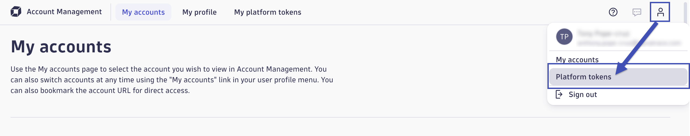

--8<-- "snippets/send-bizevent/2-getting-started.js"

<!--TODO: Remove Under Construction -->
--8<-- "snippets/under-construction.md"

<!--TODO: Update requirements -->
--8<-- "snippets/requirements.md"

## Prerequisites

You will need full administrator access to a Dynatrace SaaS tenant with a DPS license.

<!--TODO: Update prerequisite bulleted list -->
* Identify Dynatrace Tenant URL
* Identify Dynatrace Tenant Platform URL
* Generate Dynatrace Platform Token

### Identify Dynatrace Tenant URL

Identify and save/store your Dynatrace Tenant URL for the Dynatrace SaaS tenant:

!!! tip "No Trailing Slash"
    Do not include a trailing slash!

| Type        | URL Pattern                                                               |
|-------------|---------------------------------------------------------------------------|
| Live (Prod) | https://{your-environment-id}.live.dynatrace.com                          |
| Stage       | https://{your-environment-id}.sprint.dynatracelabs.com                    |

### Identify Dynatrace Tenant Platform URL

The Dynatrace platform provides a collection of so-called platform services where each has its specific area of responsibility. You can access platform services in different ways. Platform services are individually versioned and offer RESTful APIs via HTTP requests.

[Dynatrace Documentation](https://docs.dynatrace.com/docs/shortlink/otel-getstarted-otlpexport#export-to-saas-and-activegate){target=_blank}

Identify and save/store your Dynatrace Tenant Platform URL for the Dynatrace SaaS tenant:

!!! tip "No Trailing Slash"
    Do not include a trailing slash!

| Type        | URL Pattern                                                               |
|-------------|---------------------------------------------------------------------------|
| Live (Prod) | https://{your-environment-id}.apps.dynatrace.com                          |
| Stage       | https://{your-environment-id}.sprint.apps.dynatracelabs.com               |

<!--TODO: Update prerequisite details -->
### Generate Dynatrace Platform Token

Use Dynatrace Account Management to create a Platform Token.



[Dynatrace Documentation](https://docs.dynatrace.com/docs/manage/identity-access-management/access-tokens-and-oauth-clients/platform-tokens){target=_blank}

Generate a new Platform Token with the following scopes:

```
document:documents:write
document:documents:read
document:documents:delete
document:trash.documents:delete
app-engine:apps:run
app-engine:functions:run
```

### Prerequisite

Prerequisite Details


## Continue

In the next section, we'll launch our Codespaces instance.

<div class="grid cards" markdown>
- [Continue to Codespaces:octicons-arrow-right-24:](3-codespaces.md)
</div>
