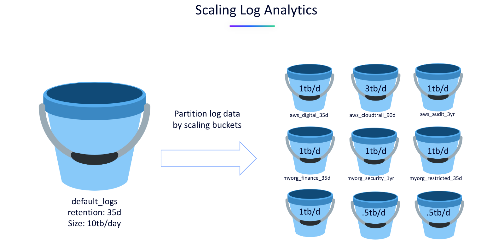

# Scaling Log Analytics
<!--TODO: Update bizevent code snippet -->
--8<-- "snippets/send-bizevent/4-content-placeholder.js"

Let’s be real — logs are your lifeline. Whether you're chasing down a production bug at 2 a.m. or trying to understand why latency just spiked, you need answers fast. That’s where Dynatrace comes in. It scales log analytics effortlessly, ingesting massive volumes without breaking a sweat, and delivers lightning-fast search and AI-powered context so you can go from “what just happened?” to “problem solved” in minutes. No more stitching together tools or waiting on queries — just instant clarity, full-stack visibility, and the kind of speed that makes you feel like a superhero.

Let's learn how Dynatrace is able to scale log analytics for your organization.

- [Learn More:octicons-arrow-right-24:](https://github.com/dynatrace-wwse/workshop-dynatrace-log-analytics/blob/main/assets/LogsWorkshop.pdf){target="_blank"}

## Logs in Context

**Automatic Correlation of Logs with Traces**

Dynatrace enriches logs with metadata such as `trace_id` and `span_id`, allowing you to seamlessly link log entries to distributed traces. This contextualization helps you understand the full transaction flow and pinpoint where issues occur within a service call or user session 

**Problem-Centric Log Views via Davis AI**

When Dynatrace detects a problem (e.g., performance degradation or error spikes), it automatically surfaces only the relevant log lines tied to that issue. This reduces noise and accelerates Mean-Time-to-Identify (MTTI). You can also run recommended queries like “Show logs for problem” or “Show surrounding logs” to expand your investigation

**Integrated Observability Across Metrics, Logs, and Traces**

Dynatrace provides a unified observability platform where logs are not isolated — they're integrated with metrics, traces, and topology data. This enables you to:

* Navigate from a log entry to the affected Kubernetes workload.
* View related metrics like resource usage and business KPI.
* Analyze service-level impact and user experience

This holistic view ensures that logs are not just raw text but part of a broader diagnostic workflow.

## OpenPipeline

**Customizable and Scalable Log Ingestion**

OpenPipeline is Dynatrace’s flexible data processing engine that allows you to ingest, extract, and enrich log data at scale. 

You can:
* Create custom pipelines to extract relevant log fields.
* Convert log entries into actionable events (e.g., Davis events).
* Route logs dynamically based on conditions like severity or error type.

This modular approach ensures that only meaningful data is processed and stored, optimizing performance and cost for large environments.

**Modular Data Flow Architecture**

OpenPipeline uses a modular data flow model where each stage can be independently configured. 

This enables:
* Fine-grained control over how logs are handled.
* Easy integration with external sources and destinations.
* Reusability and scalability across teams and environments.

This architecture supports enterprise-grade customization while maintaining performance and reliability.

**Event Extraction and AI Integration**

OpenPipeline can convert log entries into other telemetry types, extract business events, and make them actionable within Dynatrace’s AI engine. 

This means:
* Logs can trigger alerts and problem detection.
* Events can be correlated with metrics, traces, and topology.
* Teams can directly relate technical issues to business impact and speed up root cause analysis.

By turning raw logs into structured, AI-ready data, OpenPipeline helps teams solve problems faster and more intelligently.

## Bucket Strategy

**Logical Grouping of Data for Efficient Querying**

Buckets allow you to organize log data by logical boundaries such as environment, application, team, or region. 

Consider a bucket strategy by evaluating the following information:
* Ingest sources
* Estimated Ingest volume
* Retention desires
* Compliance Requirements (audit)
* Sensitive data & masking
* Permission requirements

**Bucket Considerations**

Consider the following details when using buckets with your log management and analytics solution:
* There is a limit to the number of buckets per tenant, but it can be increased based on log ingest volumes.
* Buckets exist for all data types available with Grail, not just logs - traces (spans) and business events too for example.
* Creating more buckets introduces additional administration, find the right balance.
* Leverage log attributes, including those added by OpenPipeline, to store logs in the correct bucket.

**Optimized Query Execution via Bucket Targeting**

When using Dynatrace Query Language (DQL), you can specify the bucket to query, which allows Grail to:
* Automatically optimize query execution.
* Skip irrelevant data and reduce latency.
* Leverage indexing and parallel processing for faster results.

## Segments

**Logical Filtering Across Data Types**

Segments act as predefined logical filters that span across logs, traces, metrics, events, and entities. They allow you to organize observability data by dimensions such as:
* Business applications
* Organizational units
* Infrastructure components

This logical structuring helps teams focus on relevant data, improving query efficiency and reducing noise in large-scale environments.

**Enable Reusable, Scalable Filtering**

Segments can be configured with variables, allowing dynamic filtering across multiple buckets or entities. For example:
* A segment can include a variable to filter logs by bucket name.
* Users can select one or more values at runtime, making the segment reusable across dashboards, notebooks, and workflows.

This flexibility supports scalable log analytics by enabling consistent filtering logic across apps and teams.

**Optimize Query Performance and Consumption**

By scoping queries to specific buckets or entities using segments, Dynatrace can:
* Reduce query execution time by narrowing the search space.
* Optimize license usage by avoiding unnecessary data scans.
* Improve responsiveness in apps like Notebooks and Dashboards.

This makes segments a powerful tool for performance tuning and cost control in enterprise-scale environments.

## Permissions

**Granular Access Control at Multiple Levels**

Dynatrace Grail supports fine-grained permissions at the bucket, table, field, and entity levels. This allows organizations to:
* Control who can access specific log data.
* Limit visibility based on business units, environments, or data sensitivity.
* Ensure compliance with internal and external data governance policies.

**Policy-Based Management for Scalability**

Permissions in Grail are managed through IAM policies using a flexible syntax.

For example, `ALLOW storage:buckets:read WHERE storage:bucket-name = "prod_logs"`.

These policies:
* Can be reused across users and  groups, supporting dynamic boundaries
* Support conditions like `IN`, `STARTSWITH`, and `=`, enabling scalable and dynamic access control.
* Provide access to specific log data based on record-level and field-level values

**Complement Bucket and Segment Strategy**

Controlling access to logs can be accomplished via IAM policies and defining bucket level and/or record level
access:
* Bucket level control is done via bucket names.
* Record level control is done via fields or dt.security.context which must be set on the records themselves and
defined within the policy.

Implement your permission strategy that aligns and complements your bucket and segment definitions.

## Transforming Logs to Metrics and Events

**Create Metrics from Logs**

Dynatrace, with OpenPipeline, can create metrics and aggregate metric data points from log data at ingest.  By leveraging metrics based on your log data you'll get:
* Enhanced performance through efficient storage, faster query performance, and even better scalability for large data volumes.
* Simplified alerting with easier setup, easier to generate dynamic thesholds, and easy to aggregate/summarize data.

**Create Events from Logs**

In addition to metrics, Dynatrace can extract log data into an event:
* Extract a Davis event to detect anomalies, simplify alerting, and speed up root cause analysis.
* Extract a Business Event to enable business observablity and report on business outcomes.

**Best Practices on Using Log Data**

When using data from logs on dashboards or in alerting, consider these best practices:

Dashboards:
* Use logs when low frequency refresh is required, involve a complex DQL, join different data types, analyzing short timeframes.
    * Use metrics when high frequency refresh is required, trending over long timeframes, need to optimize query costs, to create SLOs/alerts.
Alerting:
* Use logs when infrequent ingest of log records, complex queries, detailed investigations.
    * Use metrics when frequent data points, dynamic thresholds, and performance tracking.

## Continue

Now that we better understand how Dynatrace is able to scale log analytics for your organization, let's implement these strategies and best practices with hands-on exercises.

- [Continue to configuring Dynatrace:octicons-arrow-right-24:](6-configure-dynatrace.md)

