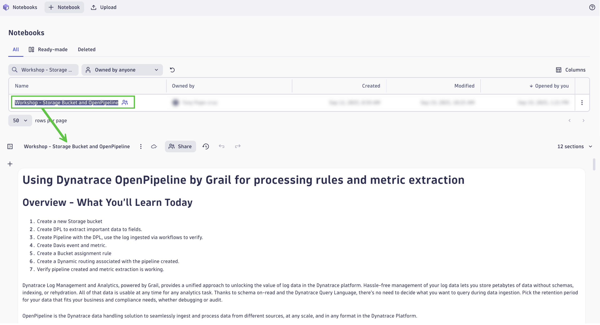
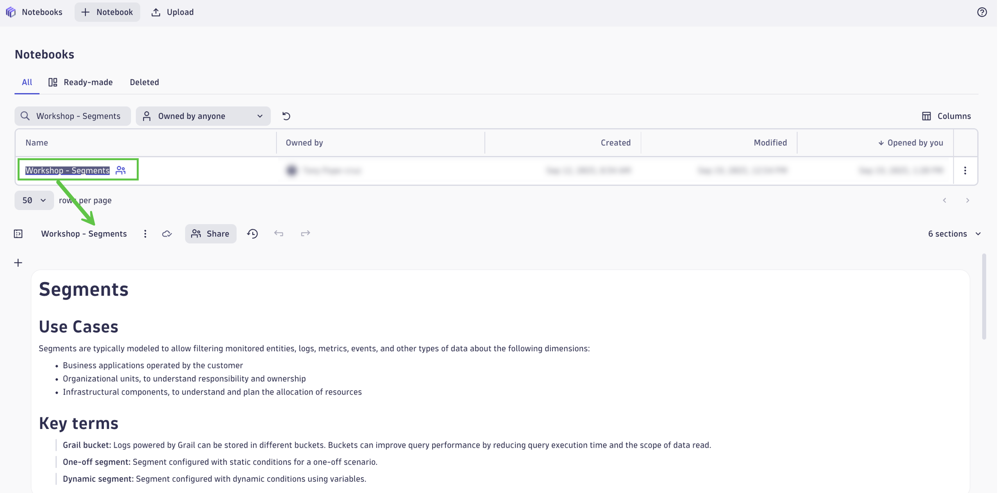

# Configure Dynatrace
<!--TODO: Update bizevent code snippet -->
--8<-- "snippets/send-bizevent/4-content-placeholder.js"

In this workshop module, we'll configure the Dynatrace tenant based on the best practices covered in scaling log analytics.

## Storage Bucket and OpenPipeline

Complete the exercises found in the Notebook `Workshop - Storage Bucket and OpenPipeline`.

## Segments

Complete the exercises found in the Notebook `Workshop - Segments`.

## Continue

In the next section, we'll introduce the Dynatrace Query Language and unlock power queries and analytics on your data.

- [Continue to Dynatrace Query Language:octicons-arrow-right-24:](7-dql-exercises.md)

