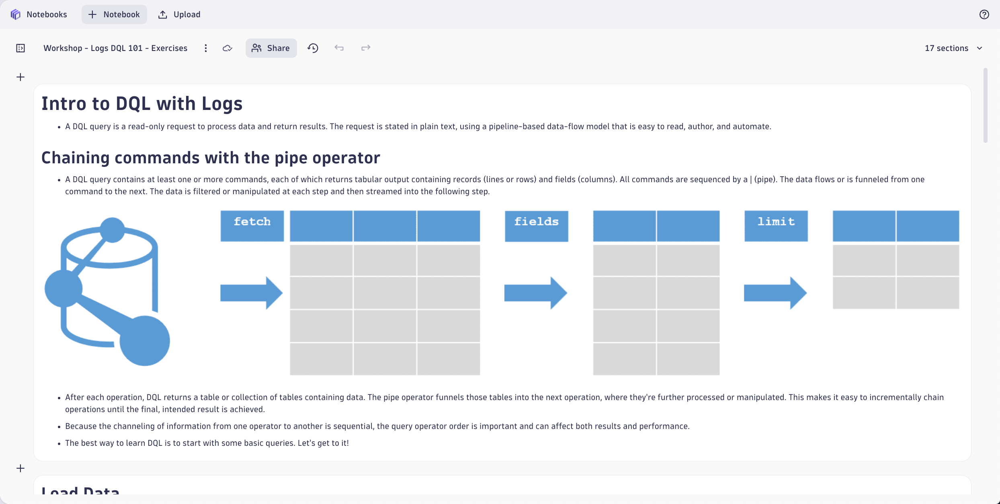
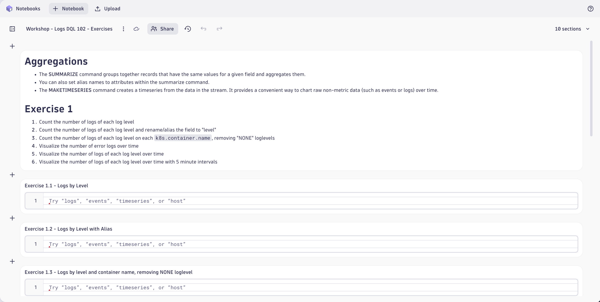
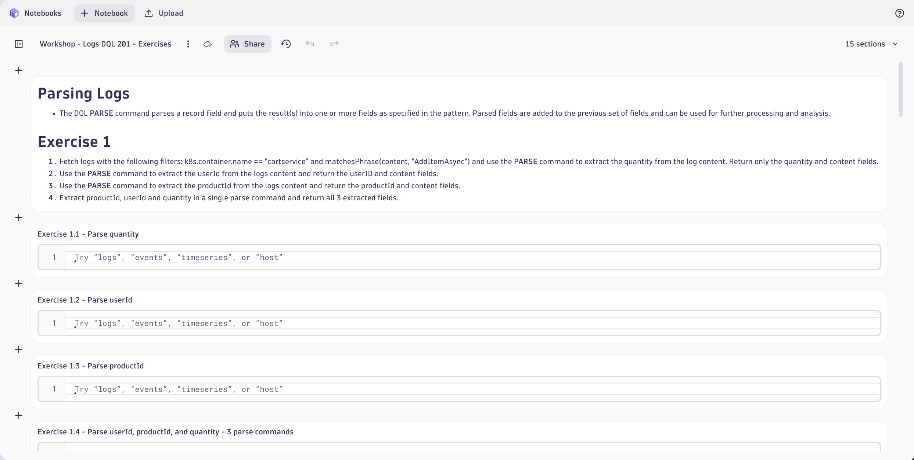
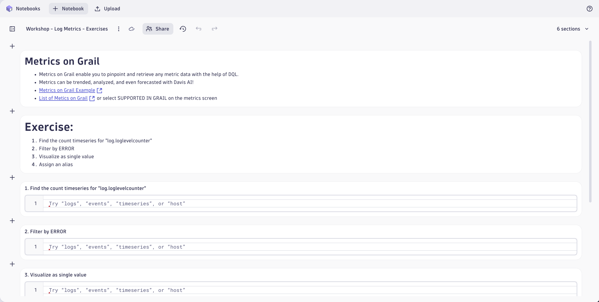
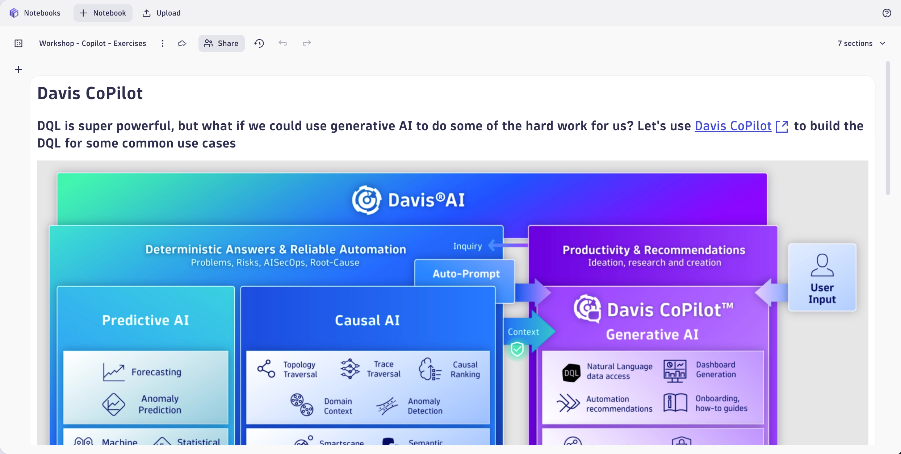

# DQL Exercises
<!--TODO: Update bizevent code snippet -->
--8<-- "snippets/send-bizevent/4-content-placeholder.js"

Now that logs are flowing into Dynatrace from our Kubernetes environment, it's time to unlock their full potential. Enter Dynatrace Query Language (DQL) - a powerful, intuitive language purpose-built for observability at scale. With DQL, you can slice through massive volumes of log data with precision, filter by meaningful attributes, extract insights in seconds, and even correlate logs with traces and metrics—all in a single query. Whether you're troubleshooting an issue, hunting for anomalies, or building dashboards, DQL makes it easy to ask complex questions and get clear answers fast. Let’s dive in and see how DQL transforms raw log data into actionable intelligence.

- [Learn More:octicons-arrow-right-24:](https://docs.dynatrace.com/docs/discover-dynatrace/platform/grail/dynatrace-query-language){target="_blank"}

Access the hands-on exercises for DQL from the Notebook in your Dynatrace tenant.  In your Dynatrace tenant, open the **Notebooks** App.  Locate the Notebook titled `Workshop - Workshop Exercises`.  We will be completing the `DQL Exercises` linked Notebooks.

## Logs DQL 101

Complete the DQL exercises found in the Notebook `Workshop - Logs DQL 101 - Exercises`.

Reference the Notebook `Workshop - Logs DQL 101 - Answer Key` as needed or upon completion.

## Logs DQL 102

Complete the DQL exercises found in the Notebook `Workshop - Logs DQL 102 - Exercises`.

Reference the Notebook `Workshop - Logs DQL 102 - Answer Key` as needed or upon completion.

## Logs DQL 201

Complete the DQL exercises found in the Notebook `Workshop - Logs DQL 201 - Exercises`.

Reference the Notebook `Workshop - Logs DQL 201 - Answer Key` as needed or upon completion.

## Log Metrics

Complete the DQL exercises found in the Notebook `Workshop - Log Metrics - Exercises`.

Reference the Notebook `Workshop - Log Metrics - Answer Key` as needed or upon completion.

## CoPilot Queries

Complete the DQL exercises found in the Notebook `Workshop - CoPilot - Exercises`.

Reference the Notebook `Workshop - CoPilot - Answer Key` as needed or upon completion.

## Continue

In the next section, we'll learn anomaly detection strategies from log data using the Davis AI.

- [Continue to Anomaly Detection:octicons-arrow-right-24:](8-anomaly-detection.md)

