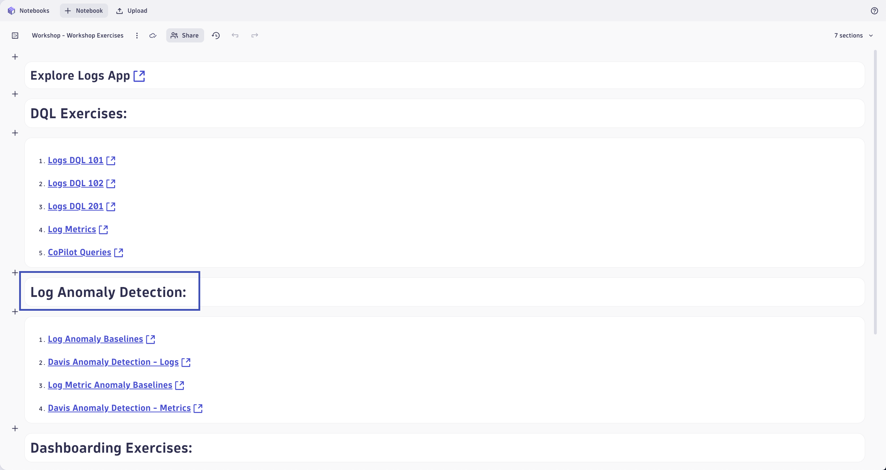
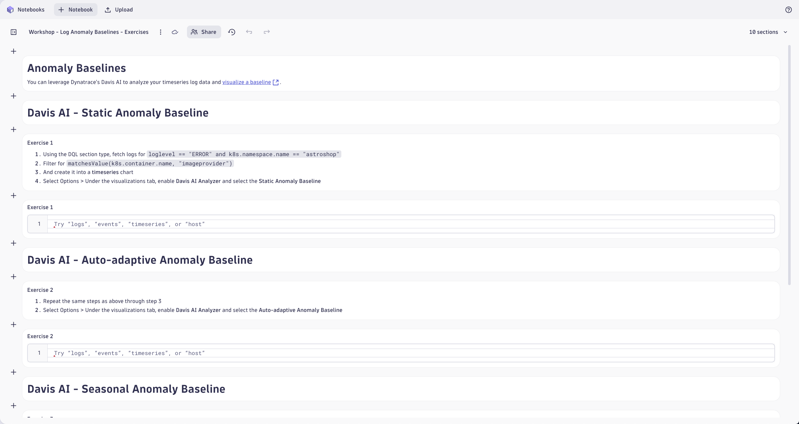
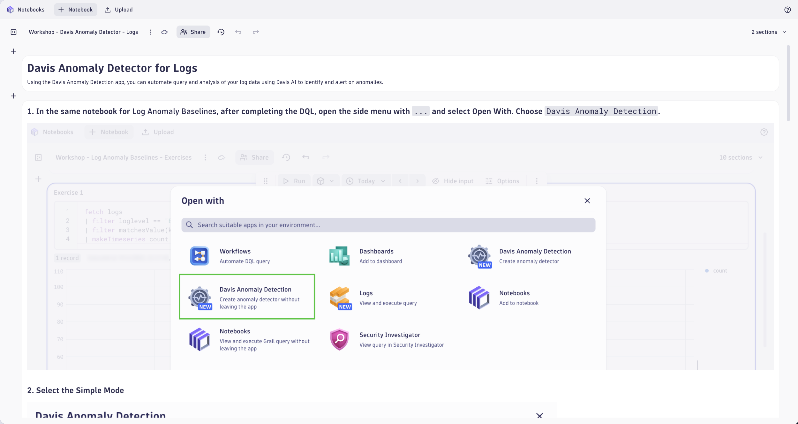
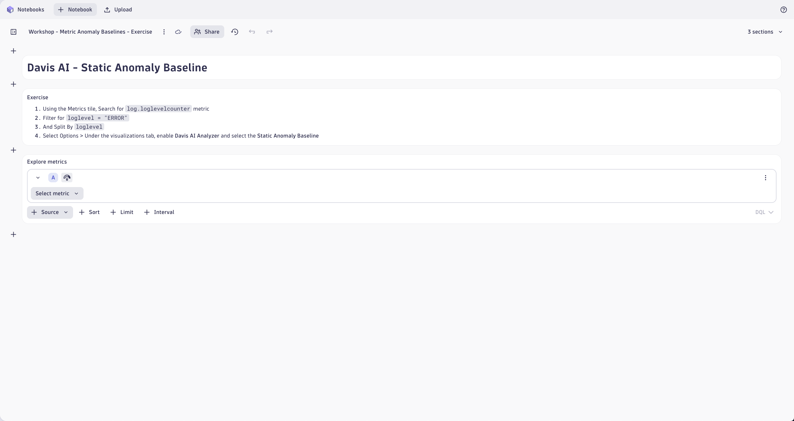
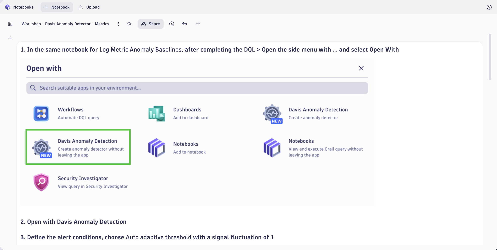

# Anomaly Detection
<!--TODO: Update bizevent code snippet -->
--8<-- "snippets/send-bizevent/4-content-placeholder.js"

Now that we know how to perform powerful queries on our log data, let's explore how Dynatrace detects anomalies by analyzing raw log records and converting them into metrics using OpenPipeline. Dynatrace enhances observability by transforming log data into time-series metrics, enabling anomaly detection through static thresholds, auto-adaptive baselines, and seasonal baselines. Static thresholds provide fixed limits for alerting, while auto-adaptive baselines learn and adjust to dynamic system behavior, and seasonal baselines account for recurring patterns such as daily or weekly cycles. This approach allows for proactive identification of performance issues and unusual behavior across your environment.

- [Learn More:octicons-arrow-right-24:](https://docs.dynatrace.com/docs/analyze-explore-automate/logs/alerting-on-logs){target="_blank"}

Return to the Notebook titled `Workshop - Workshop Exercises`.  We will be completing the `Log Anomaly Detection` linked Notebooks.

## Log Anomaly Baselines

Complete the exercises found in the Notebook `Workshop - Log Anomaly Baselines - Exercises`.

Reference the Notebook `Workshop - Log Anomaly Baselines - Answer Key` as needed or upon completion.

## Davis Anomaly Detection - Logs

Complete the exercises found in the Notebook `Workshop - Davis Anomaly Detection - Logs`.

## Log Metric Anomaly Baselines

Complete the exercises found in the Notebook `Workshop - Metric Anomaly Baselines - Exercises`.

Reference the Notebook `Workshop - Metric Anomaly Baselines - Answer Key` as needed or upon completion.

## Davis Anomaly Detection - Metrics

Complete the exercises found in the Notebook `Workshop - Davis Anomaly Detection - Metrics`.

## Continue

In the next section, we'll cover the primary features of building dashboards in Dynatrace.

- [Continue to Dashboards in Dynatrace:octicons-arrow-right-24:](9-dashboards.md)

